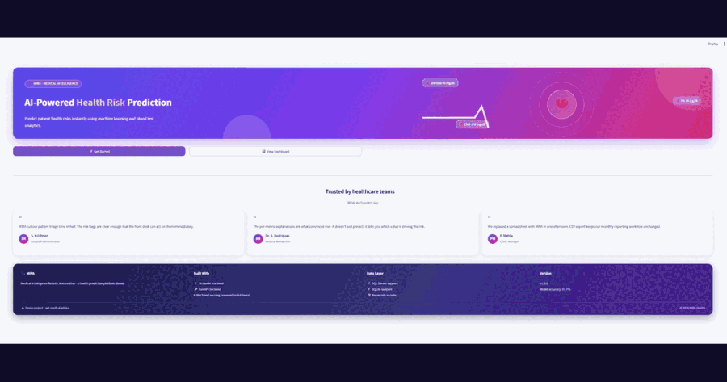

# MIRA — Health Prediction Application


**MIRA (Medical Intelligence Robotic Automation** is a full-stack health prediction web app that manages patient blood test records and uses a trained Machine Learning model to automatically predict a patient's health risk level — saved directly into the Remarks field of every record.

Built for the *Junior AI/ML Developer — Task 1* assessment.

## Features

| Feature | Description |
| --- | --- |
| 🗂️ **Patient Management** | Full CRUD — create, view, update and delete patient records, with validation at every step (email format, no future date of birth, numeric blood values — checked in the UI **and** again on the server with Pydantic) |
| 🤖 **AI Prediction Engine** | A trained RandomForest classifier (scikit-learn) predicts Low / Moderate / High health risk from age, glucose, haemoglobin and cholesterol, with a confidence score — written automatically into the Remarks field |
| 📈 **Real-Time Dashboard** | Live KPI cards, search, risk-level filters and Plotly charts that refresh automatically after every change |
| ⬇️ **CSV Export** | Download the complete patient dataset as a CSV file for reports and offline analysis |
| 🧪 **Risk Analysis** | Per-metric explanations show exactly *which* blood values are outside normal clinical ranges, so the prediction is never a black box |
| 🔐 **Secure Database** | Records stored in Microsoft SQL Server (works with SSMS) via SQLAlchemy ORM, using Windows Authentication — no passwords or secrets in the code |

Plus: a **REST API** (FastAPI) with auto-generated Swagger docs at `/docs`,
and a Streamlit frontend with a landing page, dashboard and guided
add/update/delete flows.

## Demo



## Architecture


```

## Tech Stack

| Layer      | Technology                  | Why                                          |
| ---------- | --------------------------- | -------------------------------------------- |
| Frontend   | Streamlit                   | Pure-Python UI, no HTML/CSS/JS needed        |
| Backend    | FastAPI + Uvicorn           | Fast, modern, automatic validation and docs  |
| Database   | SQL Server (via SQLAlchemy) | Robust relational storage, manageable in SSMS|
| ML         | scikit-learn RandomForest   | Reliable classifier, easy to train and ship  |
| Validation | Pydantic v2                 | Declarative request/response validation      |

## Project Structure

```
task1/
├── backend/                  # Everything server-side
│   ├── app/                  # FastAPI package
│   │   ├── main.py           # App entry point, startup logic
│   │   ├── database.py       # SQL Server connection (SQLAlchemy engine/session)
│   │   ├── models.py         # ORM model = database table definition
│   │   ├── schemas.py        # Pydantic schemas = request/response validation
│   │   ├── crud.py           # All database operations in one place
│   │   ├── routers/
│   │   │   └── patients.py   # REST endpoints (CRUD)
│   │   └── ml/
│   │       ├── train_model.py # ML training pipeline (data → train → save)
│   │       └── predictor.py   # Loads the model, generates the Remarks text
│   ├── models/               # Trained model + metrics (health_model.joblib)
│   ├── database/
│   │   └── create_database.sql # Schema script for SSMS (documentation)
│   └── tests/
│       └── test_api.py       # API tests (pytest)
├── frontend/                 # Everything client-side
│   ├── streamlit_app.py      # Streamlit app (talks only to the API)
│   ├── ui/
│   │   ├── home.py           # Home page + dashboard components
│   │   └── styles.py         # All custom CSS in one place
│   └── .streamlit/
│       └── config.toml       # Streamlit theme
├── seed_data.py              # Optional: fill the DB with 20 sample patients
├── requirements.txt
├── .env.example              # Configuration template (no secrets committed)
├── Dockerfile
└── README.md
```

## Quick Start (Windows)

After the one-time setup below, just **double-click `start_app.bat`** in the
project root - it opens the backend and frontend in two windows and the
website appears at http://localhost:8501.


## Conclusion

MIRA successfully integrates Machine Learning with a full-stack Python application for healthcare data management and health risk prediction. The system provides CRUD operations, automated predictions based on patient blood test data, and secure data storage using SQL Server. This project demonstrates practical skills in Python, Streamlit, Machine Learning, database integration, and software development best practices. The current model uses sample healthcare data and is intended for educational and demonstration purposes only.


## References

[1] Géron, A., *Hands-On Machine Learning with Scikit-Learn, Keras, and TensorFlow*, 3rd Edition, O'Reilly Media, 2022.

[2] Raschka, S., Liu, Y., and Mirjalili, V., *Machine Learning with PyTorch and Scikit-Learn*, Packt Publishing, 2022.

[3] VanderPlas, J., *Python Data Science Handbook*, O'Reilly Media, 2016.

[4] McKinney, W., *Python for Data Analysis*, 3rd Edition, O'Reilly Media, 2022.

[5] Beaulieu, A., *Learning SQL: Generate, Manipulate, and Retrieve Data*, 3rd Edition, O'Reilly Media, 2020.

[6] Delaney, K., *SQL Server Internals*, Microsoft Press, 2019.

[7] Microsoft Corporation, *SQL Server Documentation*, Microsoft Learn.

[8] The Scikit-Learn Development Team, *Scikit-Learn User Guide and Documentation*.

[9] Streamlit Inc., *Streamlit Documentation and Developer Guide*.

[10] UCI Machine Learning Repository, *Pima Indians Diabetes Dataset*.
